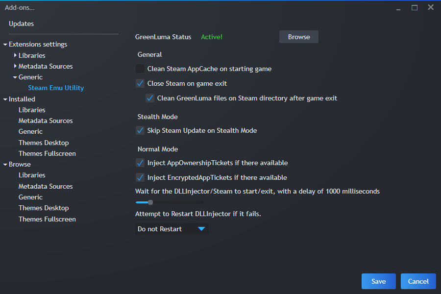

# Steam Emu Utility
Playnite Extension for using GreenLuma

## How to use it

### Load GreenLuma zip file (IMPORTANT)
1. Download the latest release SteamEmuUtility and install it into Playnite.  
2. Open Playnite and click the gamepad icon (on top-left) or by hit F9.
3. Go to Extensions settings > Generic > Steam Emu Utility.
4. Click on browse and choose GreenLuma zip file, **make sure to choose original _GreenLuma_ zip file**. If it's asking for password, you know exactly what the password is.
5. Make sure GreenLuma Status is Active, if it's active then you're good to go.

### Enable feature on game library
1. Right click on game library and make sure it's from Steam library plugin.
2. Go into Steam Emu Utility > Enable GreenLuma, and choose your desire option.
3. Click Play via playnite on selected game.

## Troubleshoot

### Failed to run DLLInjector.exe
Make sure your antivirus is disable or make an exception for Playnite folder (this is where GreenLuma store the files including DLLInjector) and Steam folder.

### Game starting without DLLInjector.exe
In addons settings, increase your Wait for the DLLInjector/Steam to start/exit value. Set to 1000 is recommended.
Also this plugin does not work with Steam Launcher Utility plugin by **darklinkpower**
